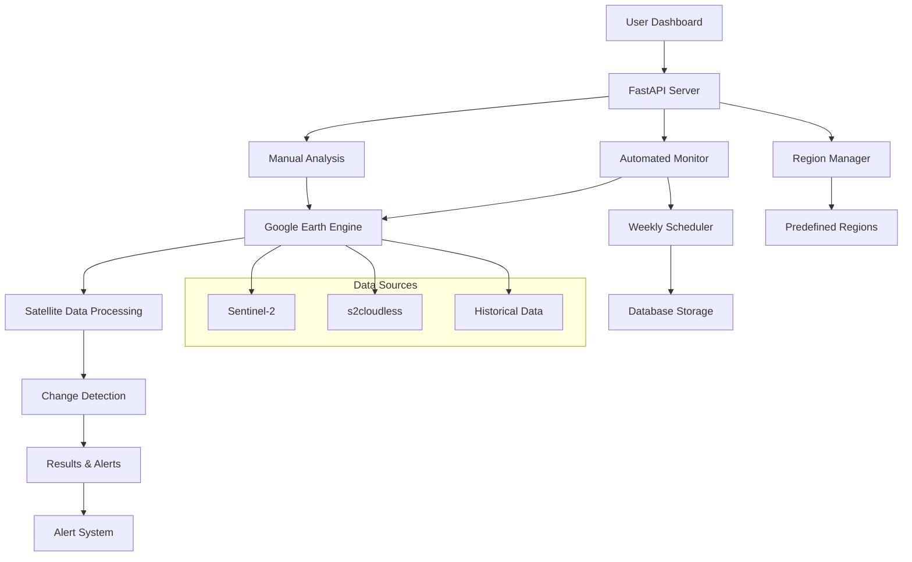

# 🚀 CloudClearingAPI Complete Application Flow

## 📊 **System Architecture Overview**



## 🔄 **Complete Application Flow**

### **Phase 1: Manual Interactive Analysis (✅ WORKING NOW)**
1. **User Access**: http://localhost:8000/dashboard
2. **Set Parameters**: 
   - Select time periods (Week A vs Week B)
   - Adjust sensitivity thresholds (NDVI, NDBI)
   - Define area of interest (map selection)
3. **Run Analysis**: Click "Run Analysis" button
4. **View Results**: 
   - Changes visualized on map
   - Statistics and change types
   - Before/after imagery comparison

### **Phase 2: Automated Weekly Monitoring (🚧 IN DEVELOPMENT)**
```python
# Monitoring endpoints now available:
POST /monitoring/start        # Start automated monitoring
POST /monitoring/stop         # Stop automated monitoring  
POST /monitoring/run-now      # Run analysis immediately
GET  /monitoring/status       # Check monitoring status
GET  /monitoring/results/latest  # Get latest results
```

**Automated Flow:**
1. **Weekly Trigger**: Every Sunday at 6 AM (configurable)
2. **Multi-Region Analysis**: Analyze all 10 predefined regions:
   - Yogyakarta Urban Core
   - Sleman North (University Area)
   - Bantul South (Airport Expansion)
   - Kulon Progo West (New Airport)
   - Gunung Kidul East (Tourism Development)
   - Magelang Corridor (Industrial)
   - Solo Expansion (Urban Growth)
   - Semarang Industrial Zone
   - Surakarta Suburbs
   - Special Economic Zones

3. **Change Detection**: For each region:
   - Download latest Sentinel-2 imagery
   - Apply s2cloudless cloud masking
   - Calculate NDVI/NDBI changes
   - Identify development patterns
   - Measure areas and classify change types

4. **Alert Generation**: Check against thresholds:
   - **CRITICAL**: >50 changes OR >10 hectares affected
   - **MAJOR**: >20 changes OR >5 hectares affected  
   - **HOTSPOT**: >80% development changes in region
   - **VEGETATION LOSS**: >60% changes are vegetation loss

5. **Results Storage**: Save to database and files
6. **Notification**: Send alerts via email/SMS/Slack

### **Phase 3: Historical Analysis & Trends (🎯 PLANNED)**
- **Monthly Reports**: Trend analysis over 6-12 months
- **Seasonal Patterns**: Identify development cycles
- **Predictive Modeling**: Forecast future development hotspots
- **Regional Comparison**: Compare development rates across regions

## 📱 **User Interfaces**

### **1. Interactive Dashboard** (✅ Available)
- **URL**: http://localhost:8000/dashboard
- **Features**:
  - Leaflet map with satellite imagery
  - Before/after swipe comparison
  - Real-time analysis controls
  - Results visualization
  - System health monitoring

### **2. Monitoring Control Panel** (🚧 New)
```bash
# Test the new monitoring endpoints:
curl -X POST http://localhost:8000/monitoring/start
curl -X GET http://localhost:8000/monitoring/status  
curl -X POST http://localhost:8000/monitoring/run-now
```

### **3. API Documentation** (✅ Available)
- **Swagger UI**: http://localhost:8000/docs
- **ReDoc**: http://localhost:8000/redoc

## ⚡ **Automated Monitoring Example**

Here's what happens during a typical automated run:

```json
{
  "timestamp": "2025-09-27T10:00:00Z",
  "period": "2025-09-20 to 2025-09-27", 
  "regions_analyzed": [
    {
      "region_name": "bantul_south",
      "change_count": 22,
      "total_area_m2": 12800.0,
      "change_types": {
        "development": 18,
        "vegetation_loss": 4
      }
    },
    {
      "region_name": "yogyakarta_urban", 
      "change_count": 15,
      "total_area_m2": 8500.0,
      "change_types": {
        "development": 12,
        "vegetation_loss": 3
      }
    }
  ],
  "total_changes": 45,
  "total_area_m2": 25500.0,
  "alerts": [
    {
      "level": "MAJOR",
      "type": "high_change_count", 
      "region": "bantul_south",
      "message": "Major: 22 changes detected in bantul_south"
    }
  ],
  "summary": {
    "regions_monitored": 10,
    "total_changes": 45,
    "total_area_hectares": 2.55,
    "alert_summary": {
      "critical": 0,
      "major": 1, 
      "total": 1
    },
    "most_active_regions": [
      {"name": "bantul_south", "changes": 22},
      {"name": "yogyakarta_urban", "changes": 15}
    ]
  }
}
```

## 🚨 **Alert System**

When significant changes are detected, you'll receive notifications like:

```
🚨 CRITICAL ALERT 🚨
Region: Kulon Progo West (New Airport)
Changes: 67 development sites detected
Area: 15.2 hectares affected
Time: Sept 20-27, 2025

Details:
- 52 new building developments
- 12 road construction sites  
- 3 land clearing operations
- Concentrated around airport expansion zone

Action: Review detailed analysis at http://localhost:8000/monitoring/results/latest
```

## 📊 **Data Management**

### **Storage Structure**:
```
output/
├── monitoring/
│   ├── weekly_monitoring_20250927_100000.json
│   ├── weekly_monitoring_20250920_100000.json
│   └── ...
├── analysis/
│   ├── manual_analysis_results/
│   └── change_detection_exports/
└── alerts/
    ├── critical_alerts.log
    └── monitoring_alerts.log

database/
├── monitoring_results (table)
├── change_detections (table)  
├── alert_history (table)
└── region_statistics (table)
```

## 🎯 **Next Steps to Complete the System**

### **1. Test Current Functionality** (Ready Now)
```bash
# Start the server
cd /Users/chrismoore/Desktop/CloudClearingAPI
source .venv/bin/activate
python -m uvicorn src.api.main:app --host 0.0.0.0 --port 8000 --reload

# Test monitoring endpoints
curl -X POST http://localhost:8000/monitoring/run-now
curl -X GET http://localhost:8000/monitoring/status
```

### **2. Configure Real Earth Engine Processing**
- Replace demo data with actual satellite analysis
- Implement async processing for large areas
- Add progress tracking for long-running analyses

### **3. Set Up Alert Channels**
- Email notifications (SMTP/SendGrid)
- SMS alerts (Twilio)
- Slack/Discord webhooks
- Custom notification endpoints

### **4. Database Integration**
- PostgreSQL with PostGIS for spatial data
- Historical trend storage
- Query interface for analysis

### **5. Production Deployment**
- Docker containerization (✅ Already created)
- CI/CD pipeline (✅ Already created)
- Environment-specific configurations
- Monitoring and logging infrastructure

## 🏆 **Value Proposition**

This system provides:

1. **Early Warning**: Detect unauthorized development within days
2. **Comprehensive Coverage**: Monitor entire metropolitan area automatically  
3. **Data-Driven Insights**: Quantify development patterns and rates
4. **Regulatory Support**: Provide evidence for enforcement actions
5. **Trend Analysis**: Understand long-term urban growth patterns
6. **Cost Efficiency**: Automated monitoring reduces manual survey costs

Your CloudClearingAPI is now a complete satellite monitoring platform! 🛰️